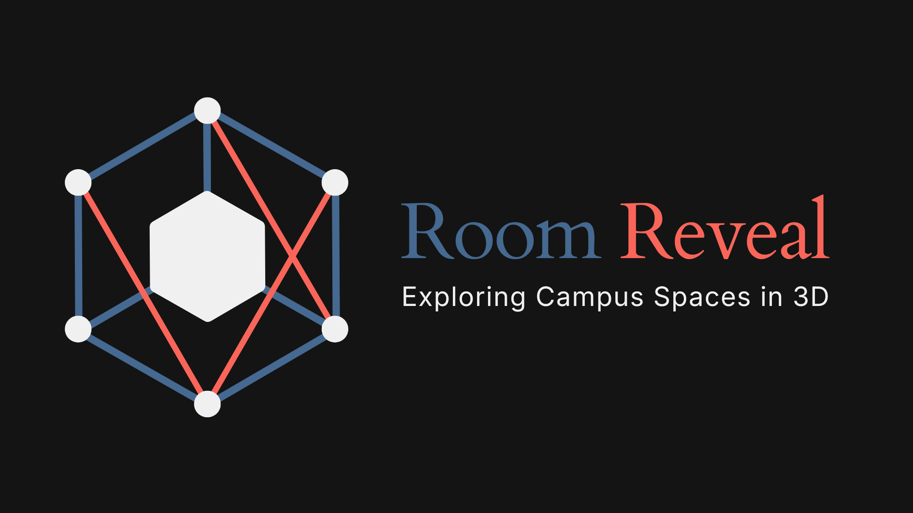

# Room Reveal



> Note: This project won at the 2026 Claude Hackathon hosted by Claude Builder Club at Purdue University! 🎉

Room Reveal is a platform where students can explore 3D Gaussian Splat models of various living spaces around campus. Models are created when users upload a video of their rooms (after specifying their location and room type) that is transformed into a Gaussian Splat 3D model by our processing pipeline. From there, any user can explore the space interactively on our website to get a sense of potential future living spaces.

## Impact

Room Reveal helps students explore living spaces in dorms or apartments around campus, helping them plan ahead for how to effectively use space, what to buy, or what accommodations they may need. This is especially useful for those with disabilities or accessibility needs, as they can get a better sense of the space before moving in. Different room configurations such as lofted beds, double vs triple occupancy within the same room type, and possibilities for furniture arrangement can be better visualized through our platform. The need for this project was inspired by the fact that currently, Purdue only provides a top-down floor plan of most dorm rooms without any pictures or videos. The floor plan leaves out important details such as the location of furnishings and actually usable space. We aim to provide a more immersive and informative way for students to explore their future living spaces before moving in.

## What it does

- Browse Purdue residences on a 3D map and choose room types
- Upload room videos (max 5 minutes) to generate new splats
- View available scans for a building/room type in an interactive viewer
- Navigate multiple scans for the same room type with left/right controls

## Tech stack

- Frontend: Vite + vanilla JS
- 3D viewer: Three.js + `@sparkjsdev/spark`
- Map UI: MapLibre GL
- Backend API + jobs: FastAPI on Modal
- Gaussian Splatting pipeline: Nerfstudio (`ns-process-data`, `ns-train`, `ns-export`) container run on Modal

## Project structure

- `src/landing.js`: main landing page (`/`) with map, selectors, upload modal, and viewer routing
- `src/main.js`: viewer page (`/viewer.html`) for loading and navigating splats
- `src/upload.js`: standalone upload page (`/upload.html`)
- `src/select.js`: standalone selector page (`/select.html`)
- `src/landing-dev.js`: coordinate tuning tool (`/landing-dev.html`)
- `src/api.js`: frontend API URL helper using `VITE_MODAL_ENDPOINT`
- `src/room-config.json`: configuration file for buildings + room types + map coordinates
- `modal_app.py`: Modal/FastAPI backend (`/upload`, `/splats/...`) and GPU pipeline job orchestration
- `pipeline/pipeline.sh`: script executed in Modal GPU jobs to produce `splat.ply`

## Frontend routes

- `/` -> landing experience (`src/landing.js`)
- `/viewer.html?building=...&room_type=...&splat_id=...` -> splat viewer
- `/upload.html` -> standalone upload form
- `/select.html` -> standalone selector for building/room/splat
- `/landing-dev.html` -> internal dev tool for coordinate tuning

## Local development (frontend)

### 1) Install dependencies

```bash
npm install
```

### 2) Configure backend endpoint

Create a local `.env` from `.env.example` and set:

```bash
VITE_MODAL_ENDPOINT="https://your-modal-app.modal.run"
```

If `VITE_MODAL_ENDPOINT` is not set, the frontend falls back to relative API paths and requests will only work if an API is served from the same origin.

### 3) Start dev server

```bash
npm run dev
```

### 4) Build for production

```bash
npm run build
npm run preview
```

## Backend overview (Modal + FastAPI)

Defined in `modal_app.py`:

- `GET /splats/{building}/{room_type}`: list available splats
- `GET /splats/{building}/{room_type}/{file_name}`: fetch `.ply` file
- `POST /upload`: upload a room video and enqueue processing

Upload/pipeline safeguards:

- Maximum upload duration: 300 seconds
- Concurrency cap: 2 GPU jobs at a time
- Locking via `/splats/_locks` to avoid over-scheduling

To run/deploy backend, use Modal CLI against `modal_app.py` (for example, `modal serve` during development or `modal deploy` for production).

## Viewer controls

- `W A S D`: move
- `Space`: move up
- `C`: move down
- `Shift`: speed boost
- `Mouse`: look around (click canvas to lock pointer)
- `Esc`: release pointer lock
- `Arrow Left` / `Arrow Right`: switch between scans for the selected room
- `Re-center` button: reset camera to origin

## Pipeline

The Gaussian Splatting pipeline used by the backend lives in `pipeline/pipeline.sh`.

For local, manual pipeline instructions, see `pipeline/README.md`.
